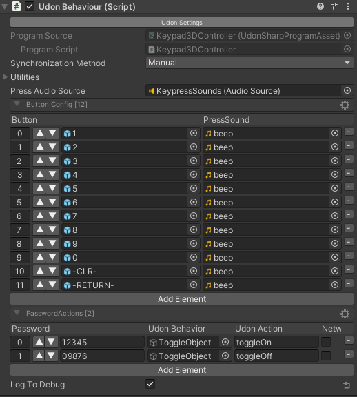

# 3-Dimensional Keypad

This is a keypad that can be customized to use 3D objects for the keys rather than a UI & Canvas system.  It's super flexible in terms of what the password can be, but requires a little bit of setup of all the buttons you plan on using.

### Setup

Add the `Keypad3DController` UdonBehavior to any object. Set up:

* `Press Audio Source` - The audio source that will play press sounds. Set this up however you want the audio to sound and originate from.
* Button Config - **Make sure you're using the UdonToolkit Editor** and click AddElement for each button you're utilizing.
  * `Button` - Assign the 3D Object that serves as a key.
  * `PressSound` - The sound it will make when pressed.
  * Make sure the button is set up properly (see below)
* Password Actions - Define the passwords and actions.
  * `Password` - The value that should be matched.
  * `UdonBehavior` - The Udon behavior that the event will be sent to.
  * `UdonAction` - The name of the custom public event to call.
  * `Networked` - Check this box if we should use `SendCustomNetworkEvent` instead of `SendCustomEvent` (sync)

**Example:** *Note that the numbers of the far left of the buttons are not relevant - they're just the array indices of the objects*

Now add all the buttons that you need for the keypad.  For each object:

* Add a `Keypad3DButton` behavior.
* Ensure that there is a child object named "pressed" (can be an empty game object)
* Set the name of the button object to the value that it will add to the password.
  * ie: If it is named 1, it will add a "1" to the end of the password.
* `Keypad Controller` - Drag in the game object holding the controller behavior we set up above.
* Set the interaction text and proximity however you want it.

#### Debugging
If it's acting screwy, you can check the "Log To Debug" checkbox on the controller for some extra output to the Unity console and VRChat debug log.

See the example scene for a working example.
