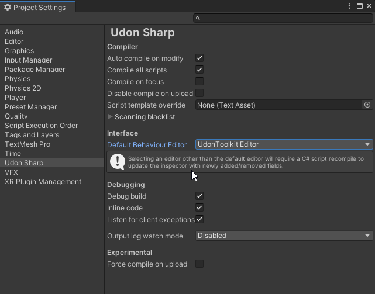

  

# Eremite's VRChat Stuff - Udon Edition

 Was this mess useful? https://ko-fi.com/eremite

This repo is here to contain a bunch of VR Chat related notes, prefabs and demos.  It serves both as a way of storing notes for myself and for showing friends/fellow creators how I go about certain things.

Things tend to be *functional* rather than *pretty* to avoid model/texture copyright problems - most stuff can be model/texture swapped relatively easily.

There are various `README.md` files sprinkled around the repo that have more information about the specific folder - particularly in release directories.  Please refer to them for more detail.

For SDK2 stuff, see the [old repo here](https://github.com/Erumite/Eremite_VRC), though keep in mind it's no longer maintained and SDK2 will likely be deprecated in the future.

#### Requirements
You'll need to install these first as some of the stuff in here relies on them:

* VRChat SDK 3.0 - https://vrchat.com/home/download
* UdonSharp - https://github.com/MerlinVR/UdonSharp
* UdonToolkit - https://github.com/orels1/UdonToolkit

Also, for best results, set the Editor to the `UdonToolkitEditor`:

```
Edit -> Project Settings -> "Udon Sharp" tab -> Default Behavior Editor = "UdonToolkit Editor"
```



#### How do I use this?
I tend to not make unity packages for this stuff, so cloning the repo and importing the `Assets/Eremite` directory will probably be sufficient.

You can probably also just clone this repo to a folder and open it as a new project in Unity.  Things might get a little screwy if the requirements are missing, so you would probably want to copy them from another project first.  So:

1. Download/Clone this repo.
2. Drag in folders from another project:
 * `VRC SDK 3.0`
 * `UdonSharp`
 * `UdonToolkit`
3. Open directory with Unity the [current version](https://docs.vrchat.com/docs/current-unity-version)

Once that's sorted, you can just do a git pull for updates.

---

# Releases
 * [3D Keypad](Assets/Eremite/Keypad-3D) - A keypad that uses 3D objects rather than a Unity UI
 * [Door Portals](Assets/Eremite/DoorPortal) POC - A replacement for VRChat portals in the form of a door.
 * [Camera Drone](Assets/Eremite/CameraDrone) - Little drone you can fly around in a world with some optional doodads

---

# Guides
( nothing here yet )

---


